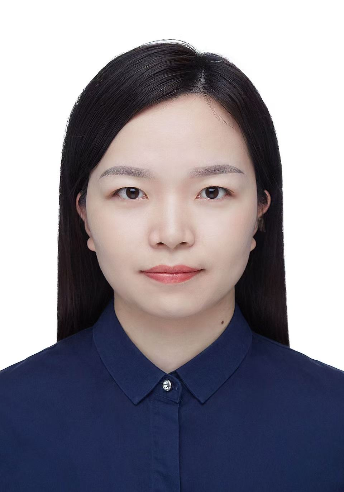
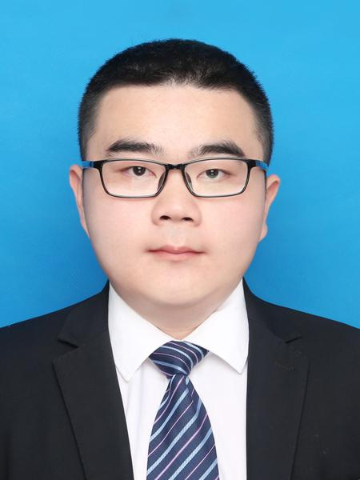

# 课题组成员

  

    
    <h3>计卫星</h3>
    
<strong>职务：</strong>北京师范大学人工智能学院 教授

    
<strong>研究方向：</strong>计算机体系结构、并行与高性能计算、代码分析与优化、大模型推理优化

    
<a href="计卫星主页链接" target="_blank" rel="noopener">个人主页</a>

  

  

    
    <h3>高建花</h3>
    
<strong>职务：</strong>北京师范大学人工智能学院 讲师

    
<strong>研究方向：</strong>计算机体系结构、并行与高性能计算、大模型推理优化

    
<a href="高建花主页链接" target="_blank" rel="noopener">个人主页</a>

  

  

    
    <h3>石剑君</h3>
    
<strong>职务：</strong>北京师范大学人工智能学院 博士后

    
<strong>研究方向：</strong>代码分析与优化

  

  

    
    <h3>刘秉鑫</h3>
    
<strong>职务：</strong>2024级博士

    
<strong>研究方向：</strong>编译优化

  

    

    
    <h3>刘攀</h3>
    
<strong>职务：</strong>2025级博士

    
<strong>研究方向：</strong>编译优化

  

